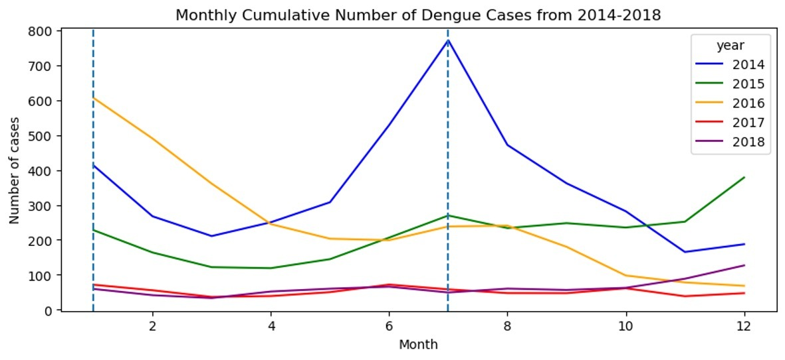

# Introduction
The aim of this project is to develop a precise predictive model for dengue outbreaks in Singapore.

To mitigate the spread of dengue fever, MOH has engaged NEA's data science team to develop a predictive model to take proactive measures to prevent and control dengue outbreaks, reducing healthcare costs and citizens' financial burden.

# Background:
Dengue fever is a mosquito-borne infectious disease that causes flu-like symptoms, such as high fever, severe headaches, joint and muscle pain, and rash. The dengue virus is transmitted to humans through the bite of an infected Aedes mosquito.

Singapore saw a significant surge in dengue cases in 2022, with over 30,000 cases reported, which is six times higher than in 2021. The increase in dengue cases has resulted in high healthcare costs for hospitals and increased financial burden on citizens.

To address the global challenge of dengue fever, the World Health Organization (WHO) has implemented a strategic approach to combat the spread of the disease. The WHO's strategy focuses on three key areas: prevention, surveillance, and control. Prevention measures include reducing mosquito populations through environmental management and targeted use of insecticides. Surveillance involves monitoring dengue cases and outbreaks, as well as tracking the spread of the disease. Control measures include early detection and timely response to outbreaks, as well as providing appropriate medical care to affected individuals.

In Singapore, the Ministry of Health (MOH) has observed an increase in hospital visitations for dengue cases in recent years. The increase in dengue cases has resulted in high healthcare costs for hospitals and increased financial burden on citizens.

# Objective
The main objective of this project is to develop a predictive model for dengue outbreaks in Singapore. The model will take into account various factors such as weather patterns, population density, and environmental factors, among others. By analyzing these factors, the model will provide an accurate prediction of when dengue outbreaks are likely to occur. With this information, NEA can take proactive measures to prevent and control dengue outbreaks, such as fogging and larviciding, reducing healthcare costs and citizens' financial burden.

# Dataset

|Feature|Type|Dataset|Description|
|---|---|---|---|
|Year|int64|complete_changi_weather.csv|the year of the data point|
|Month|int64|complete_changi_weather.csv|the month of the data point|
|Day|int64|complete_changi_weather.csv|the day of the data point|
|Daily Rainfall Total (mm)|float64|complete_changi_weather.csv|the total rainfall in millimeters for the day|
|Highest 30 Min Rainfall (mm)|float64|complete_changi_weather.csv|the highest rainfall in millimeters during a 30-minute period for the day|
|Highest 60 Min Rainfall (mm)|float64|complete_changi_weather.csv|the highest rainfall in millimeters during a 60-minute period for the day|
|Highest 120 Min Rainfall (mm)|float64|complete_changi_weather.csv|the highest rainfall in millimeters during a 120-minute period for the day|
|Mean Temperature (°C)|float64|complete_changi_weather.csv|the average temperature in degrees Celsius for the day|
|Maximum Temperature (°C)|float64|complete_changi_weather.csv|the highest temperature in degrees Celsius for the day|
|Minimum Temperature (°C)|float64|complete_changi_weather.csv|the lowest temperature in degrees Celsius for the day|
|Mean Wind Speed (km/h)|float64|complete_changi_weather.csv|the average wind speed in kilometers per hour for the day|
|Max Wind Speed (km/h)|float64|complete_changi_weather.csv|the highest wind speed in kilometers per hour for the day|
|eweek|int64|weekly-number-of-dengue-and-dengue-haemorrhagic-fever-cases.csv|the week of the data point|
|type_dengue|object|weekly-number-of-dengue-and-dengue-haemorrhagic-fever-cases.csv|the type of dengue infection|
|number|float64|weekly-number-of-dengue-and-dengue-haemorrhagic-fever-cases.csv|the number of dengue cases for that particular case type|
|Dengue fever: (Singapore)|int64|google_trends.csv|the number of searches related to "dengue fever" in Singapore|
|dengue symptoms: (Singapore)|int64|google_trends.csv|the number of searches related to "dengue symptoms" in Singapore|
|rashes: (Singapore)|int64|google_trends.csv|the number of searches related to "rashes" in Singapore|
|vomiting: (Singapore)|int64|google_trends.csv|the number of searches related to "vomiting" in Singapore|
|eye pain: (Singapore)|int64|google_trends.csv|the number of searches related to "eye pain" in Singapore|
|joint pain: (Singapore)|int64|google_trends.csv|the number of searches related to "joint pain" in Singapore|
|fever: (Singapore)|int64|google_trends.csv|the number of searches related to "fever" in Singapore|
|Wolbachia: (Singapore)|int64|google_trends.csv|the number of searches related to "Wolbachia" in Singapore|
|headache: (Singapore)|int64|google_trends.csv|the number of searches related to "headache" in Singaporee|
|nausea: (Singapore)|int64|google_trends.csv|the number of searches related to "nausea" in Singapore|
|Fogging: (Singapore)|int64|google_trends.csv|the number of searches related to "fogging" in Singapore|
|Insect repellent: (Singapore)|int64|google_trends.csv|the number of searches related to "insect repellent" in Singapore|
|Mosquito: (Singapore)|int64|google_trends.csv|the number of searches related to "mosquito" in Singapore|

# Exploratory Data Analaysis
The datasets were merged after the datetime variables were aligned and the dataset was cleaned to exclude special characters. Exploratory data analysis included looking at which factors correlated most highly with dengue cases, as well as tracking how dengue cases have changed alongside NEA's interventions and public campaigns. Mean temperature and Google searches for dengue were found to correlate with higher dengue caseloads:

</img>

</img>

</img>

These factors can be used as exogenous varibles in the time series model to predict dengue cases in 2019. 

Desk research on NEA's historical interventions were also mapped against dengue cases to see how the agency timed their public campaigns vis-a-vis dengue trends. This will inform our recommendations on when to best apply our proposed interventions. 

</img>

# Predictive Modelling
For this project, we used the Time Series modeling with the weather/climate and Google trends as exogenous features. 
In order to know which Time Series model deployment, we need to do a Time Series Diagnostics to check whether Time Series Dengue Cases is:
- Stationary or non-stationary.
- Seasonal or cyclical.

## Time Series Diagnostics

### Seasonal Decomposition 

#### Seasonal Decompose Analysis

The Seasonal Decomposition plots tell us:
- From Observed, we can see there are 2 spikes in Dengues cases. One is between Jul-Aug 2014, and the other is the beginning of the 2016.
- From Trends, we can see there is a downward trend in the number of Dengue cases from 2014 till 2018.
- From Seasonal, we can see the seasonal pattern of Dengue cases is 6 months or 26 weeks.
- From Residual, we can see the spike in residual corresponds to the spike in the Dengue cases from Observed.The Residual do not have a constant mean and variance over time.

Hence, we can deduced that the Dengue cases are seasonal in nature and the data is not stationary as inferred from the Residual plot not having constant mean and variance over time.

### ACF and PACF plots

#### Original Time Series Dengue Data

From the Dickey-Fuller test of the Original Time Series Dengue Data, we can see that:
- The test statistic is a negative value and is more negative than the critical values at the 5% and 10% levels, but not at the 1% level.
- The p-value is greater than 0.05 (assuming a significance level of 5%), which indicates weak evidence against the null hypothesis of non-stationarity.

Therefore, based on these results, we cannot reject the null hypothesis that the time series is non-stationary. In other words, there is not enough evidence to suggest that the time series is stationary.

#### 1st differenced Time SEries Dengue Data

From the Dickey-Fuller test, we can see that:

- The test statistic is a negative value, which is more negative than the critical values at the 1%, 5%, and 10% levels.
- The p-value is very small, which suggests strong evidence against the null hypothesis of non-stationarity.
- Therefore, based on these results, we can reject the null hypothesis that the time series is non-stationary. In other words, there is enough evidence to suggest that the time series is stationary.

The ACF plot shows a gradual decay to zero and the PACF plot has a sharp drop-off after a certain lag, this suggests that the Time Series is stationary. This pattern indicates that the autocorrelations are small and decay quickly, and there are no significant autocorrelations beyond a certain lag.

#### Conclusions

- Sarimax model needs to be deployed as we know there is a seasonal aspect to the Dengue time-series data.
- 1st differencing will ensure the time-series data to be stationary, so we know the non-seasonal d=1.
- From the ACF plot, we know there is a sharp drop in value at lag=1, so we can infer non-seasonal q=0 or 1.
- From the PACF plot, we also know there is a sharp dop in value at lag=1, so we can also infer non-seasonal p=0 or 1.

## SARIMAX Modeling

We set the non-seasonal order to be (0,1,1) and we try out with SARIMAX models with different seasonal orders [(0,0,0), (0,0,1), (0,1,0), (1,0,0), (1,1,1)] with period of 26 weeks.

The AIC, Log-Likelihood and RMSE for the different SARIMAX models as shown below.

We chose SARIMAX model of seasonal order (0,0,0) for 
- lowest AIC.
- highes Log Likelihood
- RMSE within acceptable range. 

The predictive plot is as shown below.

## Forecast Study

The Forecast plot for the SARIMAX model with seasonal order (0,0,0,26) aligns with the 'unseen' actual Dengue values 2019. The Forecast plot is able to forecast peaks of Dengue cases within Jun-Jul periods. Hence, we will use SARIMAX model with non-seasonal order (0,1,1) and seasonal order (0,0,0).

# Cost-Benefit Analysis

# Conclusion & Recommendations
- June-July has been identified to be the months with the highest number of dengue cases.
- Through early detection, Singapore can foresee a reduction in 28% of total cost within the healthcare sector, which dedicates its efforts to combat and treat the dengue virus. 
- NEA should maintain their efforts in conducting campaigns to bring about awareness to ultimately drive down the number of dengue cases.
- The organization is recommended to plan to conduct their campaigns at least 2 months in advance (March/April), to bring resident’s attention to the potential increase in number of dengue cases so that they can take proactive measures to safeguard themselves and their loved ones.
